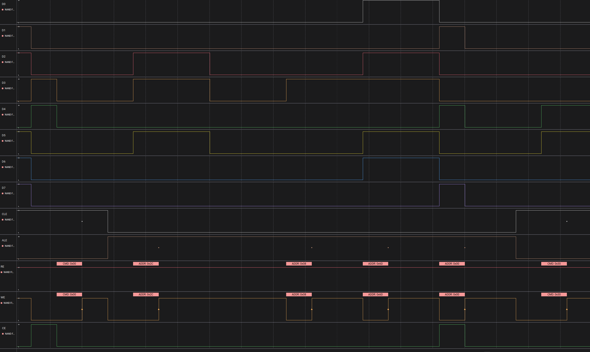
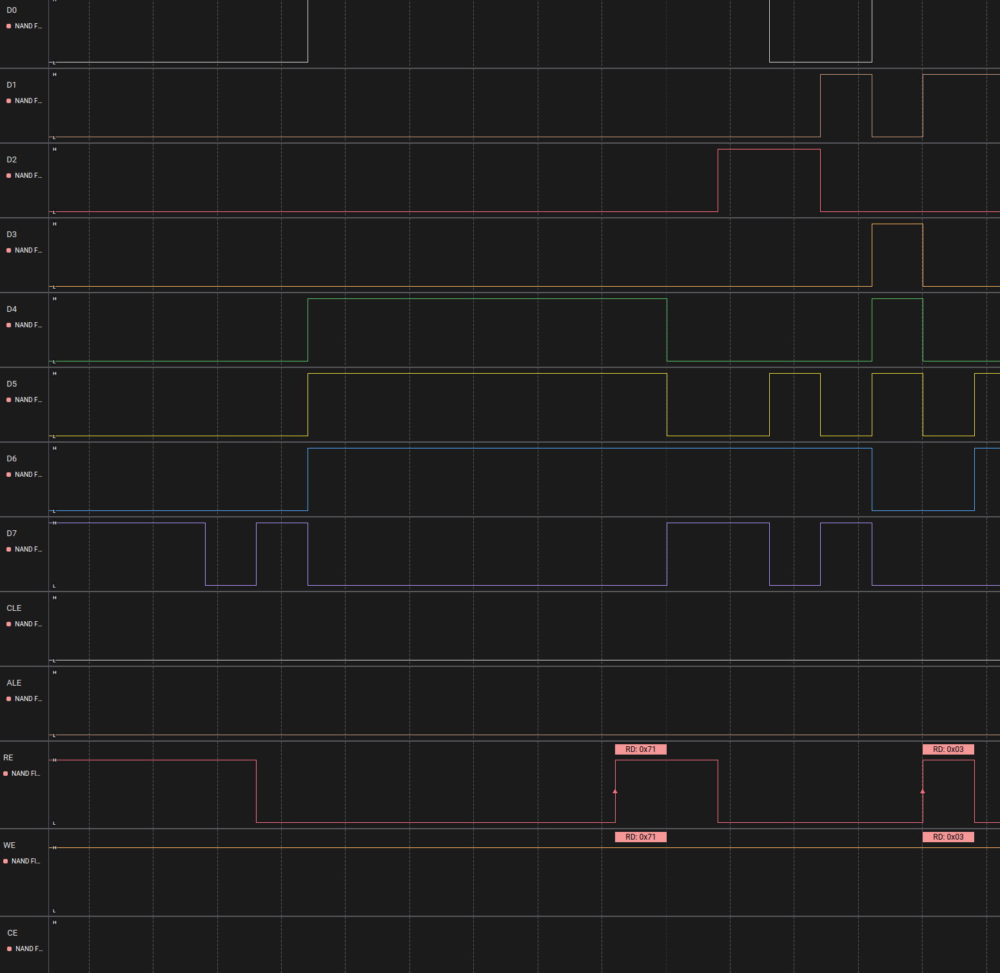
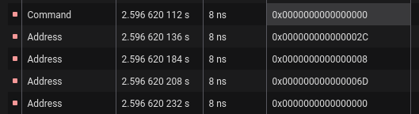
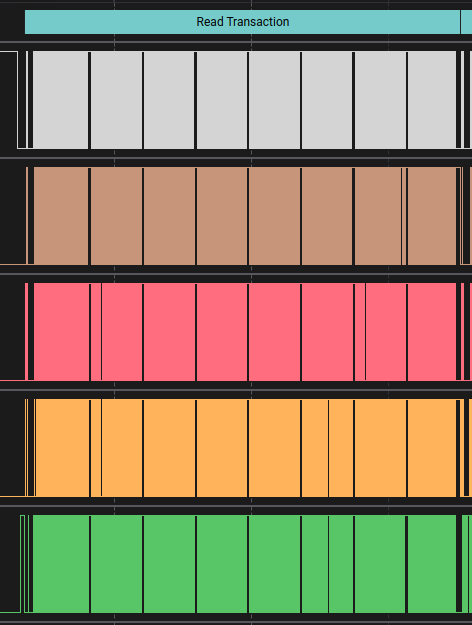

# Open NAND Flash Interface Analyzer
This project was used with the Saleae logic analyzer software to decode and recreate the raw data captured from the logic analyzer.

The equipment under test (EUT) stored its filesystem on a NAND flash chip and when the hardware booted up, the contents from the NAND flash were read from the chip. The flash chip used the [Open NAND Flash Interface](https://www.onfi.org/specifications). (NOTE: We looked at this a few years ago and I don't remember which specification version we referenced.) We used the logic analyzer to capture the signal of the 8-bit bus (i.e., 8 wires carrying data) plus the `WriteEnable` and `ReadEnable` lines.

Once we captured the data and ran this plugin to interpret the reads and each bit, we export the data to a file for further processing.

Because the logical analyzer is capturing all hardware level communications, you'll also capture the Error Correction Codes. This plugin doesn't remove or deal with the ECC data after each read. A simple python script can take care of that and I can't for the life of me find the script we used.

## Features
Below are some screenshots of the features. The analyzer supports decoding commands, addresses, and I/O data. There is
also a data extractor plugin that exports each read transaction and marks the read transaction in Logic.

**Issuing a command with address**

**Issuing a command with address**

**Issuing a command with address**

**Issuing a command with address**

## Building
Refer to Saleae's [building guide](https://github.com/saleae/SampleAnalyzer/tree/master?tab=readme-ov-file#building-your-analyzer).
